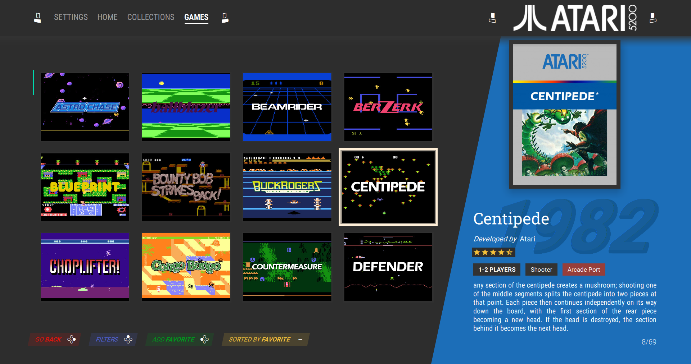
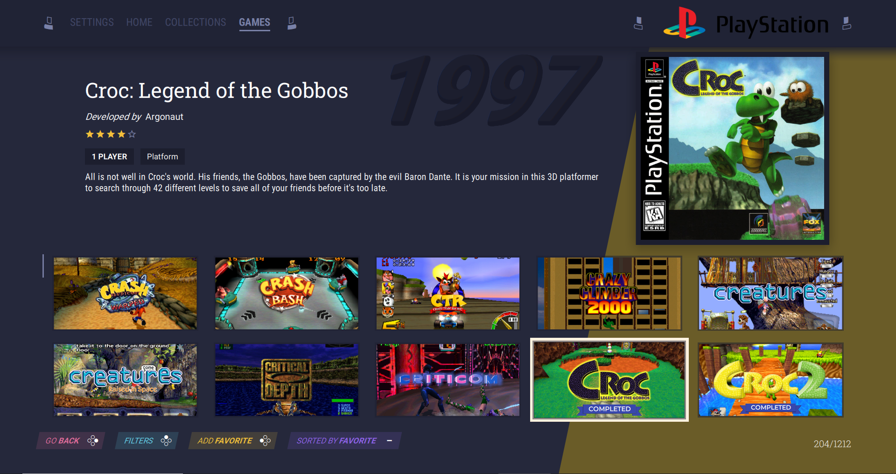
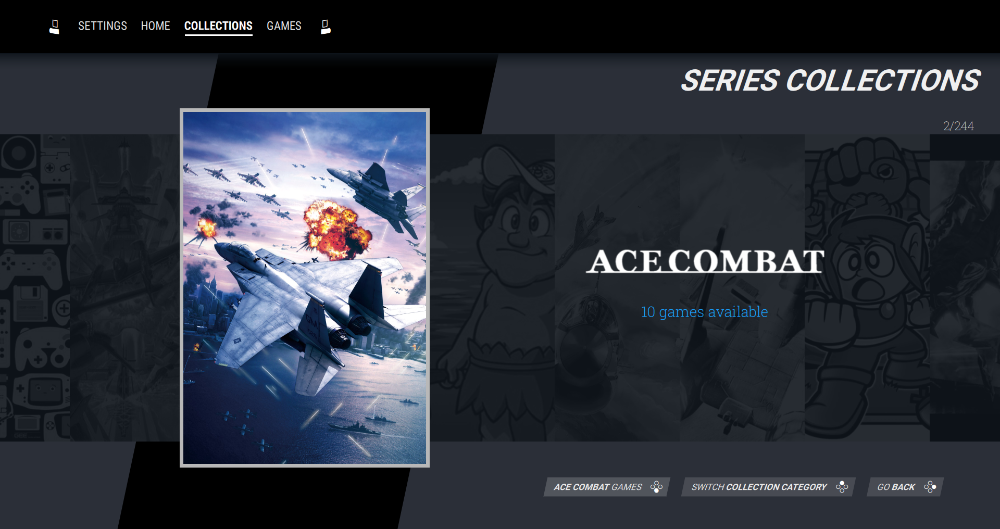
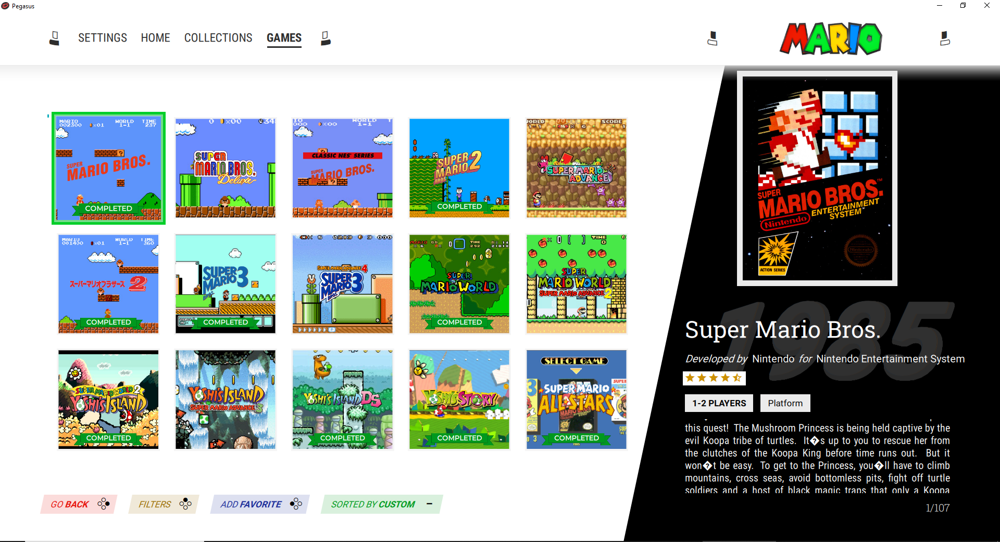

# shinretro-custom

A modified version of the excellent Shinretro theme, with several performance fixes, new features and some personal preference-type updates (theme art, logos, favorite icon etc)

Key features/changes to the base theme (some of these will likely be incorporated into upstream as well, but noting here for reference and guidance:

**Personal preference changes**
 - Changed favorites icon to use the icon and design from the gameOS theme (https://github.com/PlayingKarrde/gameOS)
 - Changed the currently selected game border to use a color cycle animation to make it more clear. The color of the border can either be consistent across the color theme, or can change based on the particular collection (settings option)
 - Manufacturer logo shown on the Collections screen uses a different look + feel
 - Some different background art/logos or color theme choices for the various collections or base themes

**Usability/Performance Adjustments**
 - Page up/Page down can be configured via settings to either skip to next/previous collection when in the game grid view (default), or can instead be used to rapidly scroll up/down the games list for quicker navigation of large collections
 - The collections carousel now supports press & hold to quickly scroll through the list
 - Several updates to improve performance so no stutters or delays when scrolling through collections or games, or loading the theme etc
 - Will automatically render the game title, year and detail text as either dark or light color depending on the background color to ensure readability in all configurations

**New Features**
- Dedicated Last Played + Favorites collections can be enabled or disabled via Settings menu
- Collection Category support (requires custom metadata, detaileded below) - able to group collections into Categories - use the Filters key to toggle each category in the collections view
- Collection Sorting - Use the Select/Back button on the controller to toggle sorting game grid by Title/Last Played/Favorite/Genre or Rating.
- Custom Sorting (requires custom metadata, will be detailed below soon) - define a custom sort order for specific collections based on game metadata values
- Completed Game Ribbon (requires custom metadata, detaileded below) - Adds a "Completed" ribbon to games you've marked as complete in your game metadata
- Arcade Port tag (requires custom metadata, detailed below) - Adds an "Arcade Port" icon to the games detail view if you've marked the game as an arcade port in your game metadata

WIP - More to come as I think of it and will include details on the custom metadata needed for some of the above features.

----------------

Current Version: [0.138](CHANGELOG.md) 

A flexible and tweakable theme for [Pegasus Frontend](http://pegasus-frontend.org).
Forked from [Valentin MEZIN](https://github.com/valsou)'s theme [neoretrō](https://github.com/valsou/neoretro) v0.131 and [Luciano Oliveira](https://github.com/luciano-work)'s dark variant.

***

  
<b>Screenshots</b>

  
  
  
  
  
  
  
  
  
  
  
  
  
  
  

***

  
<b>Videos</b>

  
  Theme review by [Retro Gaming Replay](https://www.youtube.com/channel/UC_9gbkxeMk3usXvSzYzimMw)
  
  

  Custom Version of [RoeTaKa](https://www.youtube.com/channel/UCAbHcM41hzH9lku_3XqFYZg) with changed collection images
  
  
  

  
***

**Contributions are welcome**

You can code and found a bug in the theme you can fix or want to add a feature to the theme?
Or you can't code but want to add translations for your native language or you can provide some awsome artwork for the theme?

Simply have the courage and make a pull request :relaxed: 
You can find some guidances [here](HACKING.md).

## Features
- selectable color schemes
`dark` `light` `ozone dark`
- costumizable game view
- different onscreen control options
`Universal (Switch like)` `XBOX` `Playstation`
- different languages support
- toggleable video playback options

and more...
You can find explanations for the theme settings [here](SETTINGS.md).
  
## Metadata in use
- boxFront
- screenshot
- titlescreen (fallback for screenshot)
- wheel
- background
- video
- arcade port (custom metadata field)
- completed (custom metadata field)
- collection type (custom metadata field on collection)

## Regarding videos on collection screen
> NOTE: Videos for the collection screen are not included in the theme. You can provide them by setting a default video for your collection in the Pegasus metadata of the collection. EXAMPLE:
> 
    collection: Sony Playstation 2
    shortname: ps2
    assets.video: media/videos/default.mp4

## Collection Categories
Group your collections into categories, for example by System, Series, Genre etc.
If you add a category field to your collection metadata files, the theme will allow you to switch between categories on the collection carousel screen by using the Filter button

To use this feature, add a new field 'x-collectiontype' to your collection metadata with the category you want to assign for that collection.

## Arcade Port flag
If a game is tagged as an Arcade Port, the theme will add an Arcade Port tag to the details view, next to the Players and Genre tags.

To use this feature, add a new field 'x-arcadeport' to your game metadata with a value of 'True'.

## Completed Ribbon
If you want to track which games you have finished, the theme can display a "Completed" ribbon on the grid view if a game has been marked as completed.

To use this feature, add a new field 'x-completed' to your game metadata with a value of 'True'.

## Custom Sorting
This theme supports custom sorting for collections. Say for example you want to construct a playlist of games to play in a specific order, or you want to showcase a collection based on series and want to order the games properly even if the game titles or release years aren't in a particular order. 

The default sort-by metadata field would allow you to set a sort title but then this would apply to every collection a particular game shows up in, so if you had a "Mario" series collection and adjusted your sort-by field to set the order, games might show up in the wrong place in your "NES" system collection.

To use this feature, for every game you want to use custom sorting, add a new field to your game metadata in the following format: 'x-customsort-<collectionshortname>': <sortnumber>

So for this example lets say we want to display a custom sort that lists all Mario games, and we want to show the games in chronological order but group any rereleases with the original (so Super Mario Bros for NES should come first, then the Game Boy Color and Game Boy Advance rereleases, followed by Super Mario Bros 2 for NES and then Super Mario Advance etc).

In the above case, here is what the relevant game metadata would look like ():

> 
    game: Super Mario Bros.
    file: ..\..\..\roms\nes\Super Mario Bros. (World).7z
    sort-title: Super Mario Bros.
    x-customsort-mario: 010

    game: Super Mario Bros. 2
    file: ..\..\..\roms\nes\Super Mario Bros. 2 (USA) (Rev A).7z
    sort-title: Super Mario Bros. 2
    x-customsort-mario: 015

    game: Super Mario Bros. Deluxe
    file: ..\..\..\roms\gbc\Super Mario Bros. Deluxe (USA, Europe) (Rev B).7z
    sort-title: Super Mario Bros. Deluxe
    x-customsort-mario: 011

    game: Classic NES Series: Super Mario Bros.
    file: ..\..\..\roms\gba\Classic NES Series - Super Mario Bros. (USA, Europe).7z
    sort-title: Classic NES Series: Super Mario Bros.
    x-customsort-mario: 012

    game: Super Mario Advance
    file: ..\..\..\roms\gba\Super Mario Advance (USA, Europe).7z
    sort-title: Super Mario Advance
    x-customsort-mario: 016

And the final result would look like this:

When you view a game collection, the theme will automatically detect the presence of this custom sort tag - if at least one game is found in the collection with custom sorting defined, then 'Custom' will be an option to Sort By and will be the default one selected. Otherwise, Custom won't appear in the list of available sort by fields and you can sort by the standard fields (Title, Release, Genre, Favorite, Last Played).

## Example Metadata Files with Custom Metadata added
An example of a collection and a game entry with the custom metadata this theme can use if they are included. None of the custom metadata is required to use the theme, they are only enhancements if added.

Collection example with Collection Type added:
> 
    collection: Ace Combat
    shortname: acecombat
    sort-by: Ace Combat
    x-collectiontype: Series

Game example with custom fields added for Completed, Arcade Port:
> 
    game: Altered Beast
    file: roms\amiga\AlteredBeast_v2.0_0819.lha
    sort-title: Altered Beast
    release: 1989
    developer: Sega
    publisher: Sega
    genre: Action
    players: 2
    x-system: amiga
    rating: 0.8
    description: You are a hero raised from the dead by the god Zeus to rescue his daughter Athena. With scenery inspired by Ancient Greece, you have to fight hordes of undead and demons, with a boss at the end of each level until you meet the god Neff, who holds the girl captive.    The Altered Beast title refers to your shapeshifting abilities. In this platformer, you can collect spirit balls by defeating two-headed wolves, allowing you to mutate into different beasts such as a werewolf, a dragon, a tiger, a bear and others depending on the version. Each form, tied to a level, comes with special abilities such as flight and powerful attacks, easily superseding the basic set of punches and kicks in your human form.    The game can be played in single player mode, or in same-screen multiplayer co-op mode.
    x-completed: False
    x-arcadeport: True

## Work in progress
- [ ] clean the code...
- [ ] add more language options
- [ ] missing backgrounds/logos for collections and manufacturers 

## Considerations / ideas for the future
- [ ] provide some default collection videos
     - probalby need some original assets
- [ ] per collection fallback default background images
- [ ] filter by game genres
- [ ] add an attract mode

## Thanks to:
- [Valentin MEZIN](https://github.com/valsou) : Creator of the original neoretrō which this theme is based on
- [Luciano Oliveira](https://github.com/luciano-work) : Creator of the dark color scheme for neoretrō
- [HunkDeath](https://github.com/HunkDeath)  & [fansubmaniac](https://github.com/fansubmaniac) : french translations
- [RickEves](https://github.com/RickEves)  : portuguese translations
- [RoeTaKa](https://www.youtube.com/channel/UCAbHcM41hzH9lku_3XqFYZg)  : custom sfx & bgm music
